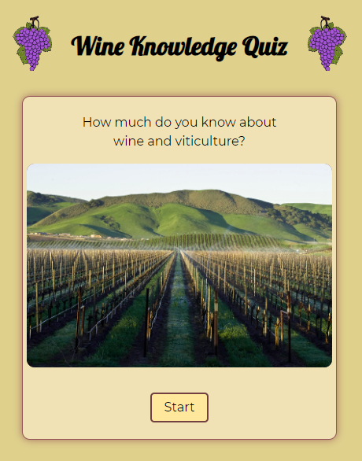

# Wine Quiz App

A simple app built using HTML, CSS, and JS designed to test the user's knowledge of wine and viticulture.  

  

## Description

Users are presented with ten multiple choice questions about wine and viticulture. They are given appropriate feedback for correct and incorrect answers.  The current question and score are displayed throughout. The final screen displays the overall score, an appropriate message, and an option to restart the quiz from the first question.

## Installation

Download the project files and open the index.html file in your browser to get started!

